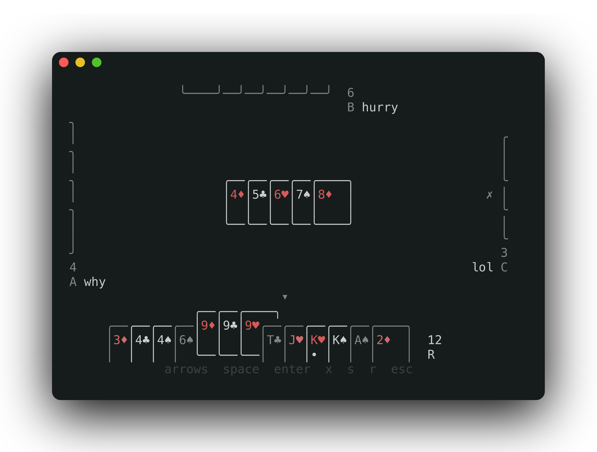

# deuception

A networked, terminal Big 2 (Deuces / 鋤大弟). One binary is both the game and the
server: you run it, land in a waiting room, and friends join over SSH, nothing to
install. You only ever see your own hand; everyone else is a face-down count. The
board is deliberately plain so it doesn't obviously read as a game, and there's even
a key to hide the card UI. Short-handed? The host can fill seats with bots.



## Requirements

- Go 1.25+ to build (`brew install go`)
- Whoever's joining just needs `ssh` (every terminal has it)

## Run

```sh
make run                 # build + start on :2222; you host and play locally
# or
go build -o bin/deuception ./cmd/server && ./bin/deuception -port 2222
```

You land on a waiting page; others join from their own terminals:

```sh
ssh -p 2222 <your-host>
```

The host presses **enter** to start once 2+ players are in, and can fill empty
seats with bots first (`+`). After that, new connections are turned away, and
everything lives in memory; stop the binary and the room is gone.

Headless (no local host, so the first person to connect becomes host):

```sh
./bin/deuception -serve-only -port 2222
```

## Controls

**Waiting room:** `a`-`z` pick your letter, `enter` start (host), `1`-`9` set bot
difficulty, `+`/`-` add/remove a bot (host), `esc` quit.

**In-game:** `←`/`→` move the cursor (or scroll your hand when it isn't your turn),
`space` select/deselect, `enter` play, `x` pass, `c` clear selection, `h` hide the
card UI, `esc` quit.

**Between hands:** `enter` deals the next hand (host), `esc` quit.

## Rules (this build)

- Ranks `3 4 5 6 7 8 9 10 J Q K A 2`; suits `♦ < ♣ < ♥ < ♠`.
- Plays are 1, 2, 3, or 5 cards; five-card hands rank
  straight < flush < full house < four-of-a-kind < straight flush.
- Straights run in rank order and top out at 2; the highest is `J-Q-K-A-2` and the
  lowest `3-4-5-6-7` (no ace-low wrap).
- The first play of a hand must include the lowest dealt card (the `3♦` when it's
  in play).
- Passing is locked out: once you pass you're done until the trick resolves.
- Scored match: each hand, you take penalty points for the cards left in your hand
  (×2 at 8 to 9, ×3 at 10 to 12, ×4 at 13+). Totals carry over and the host deals
  again with **enter**; lowest total wins.
- Drop out and your seat stays in as a dead player (`D`) that auto-passes, with no
  rejoining.

## Layout

```
cmd/server         the binary: SSH server + local host TUI
cmd/preview        dev aid: render every screen headlessly at fixed sizes
cmd/sshprobe       dev aid: connect N SSH clients and smoke-test the transport
internal/game      rules engine: no I/O, unit-tested
internal/bot       heuristic Big 2 player (public info only)
internal/room      one in-memory room actor + redacted per-viewer fan-out
internal/protocol  the snapshot messages between room and client
internal/tui       Bubble Tea models + responsive rendering
```

## Develop

```sh
make test      # go test ./... -race
make vet
make preview   # dump every screen at a few sizes
```

## License

MIT. See [LICENSE](LICENSE).
